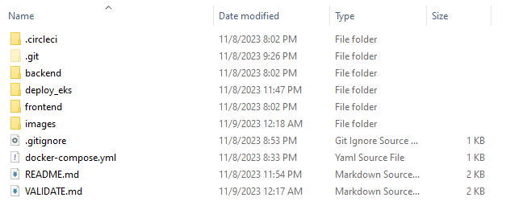
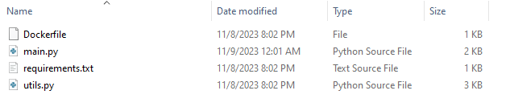
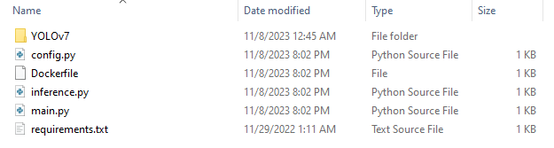

# Udavid 

Note for revewer: Please see https://github.com/psybinh/udavid/blob/master/VALIDATE.md

### Overall

Object detection web app

Deployed URL: http://a6e792be6667d4288a923e90caba9694-530918475.us-east-1.elb.amazonaws.com:8501/

- `.circleci`: CI configure with circle CI
- `backend`: backend service, get input image and return type, bounding box and confidence of objects
- `deploy_eks`: Deploy yaml files for eks deployment task
- `frontend`: Fontend service, upload file, choose model and view the result.
- `docker-compose.yml`: Deploy on local with docker

### Compornents

##### Frontend service:

 

- `Dockerfile`, `requirements.txt`: File to build docker and libraries
- `*.py*`: Code frontend with StreamIt

##### Backend service:

- `Dockerfile`, `requirements.txt`: File to build docker and libraries
- `YOLOv7`: Yolov7, object detection deep learning model
- `config.py`: Config supported models
- `inference.py`: Load pre-trained model and predict
- `main.py`: FastAPI server

### Setup and run on local

- Run `docker-compose up`

- Access to the page `localhost:8501` to use the app

### Setup and run on AWS EKS

##### Step 1: Create cluster

- `eksctl create cluster --name udavid --region=us-east-1 --nodes-min=2 --nodes-max=3`

##### Step 2: Deploy the app

- `kubectl apply -f backend-deployment.yaml`
- `kubectl apply -f frontend-deployment.yaml`

- `kubectl apply -f backend-service.yaml`
- `kubectl apply -f frontend-service.yaml`

##### Step 3: Create router

- `kubectl expose deployment frontend --type=LoadBalancer --name=publicfrontend`

##### Step 4: Use the web app

# Reference
- [Object detection web](https://github.com/yeha98555/object-detection-web-app.git)
- Object detection 
    - [OpenCV-dnn](https://github.com/hpc203/yolov7-opencv-onnxrun-cpp-py)
    - [ONNXRuntime](https://github.com/ibaiGorordo/ONNX-YOLOv7-Object-Detection)
- [yolov7 onnx](https://github.com/PINTO0309/PINTO_model_zoo/tree/main/307_YOLOv7) 
- [Download google drive files with wget](https://www.matthuisman.nz/2019/01/download-google-drive-files-wget-curl.html)