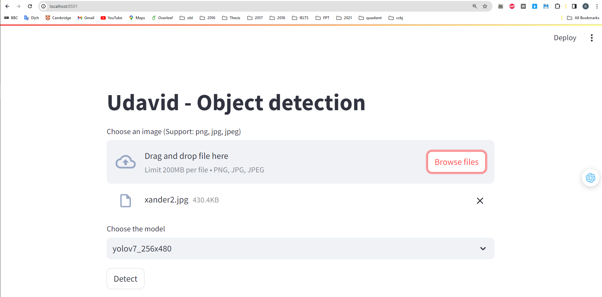
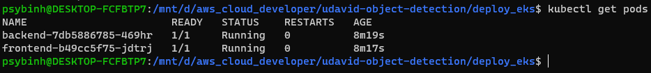
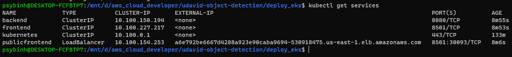
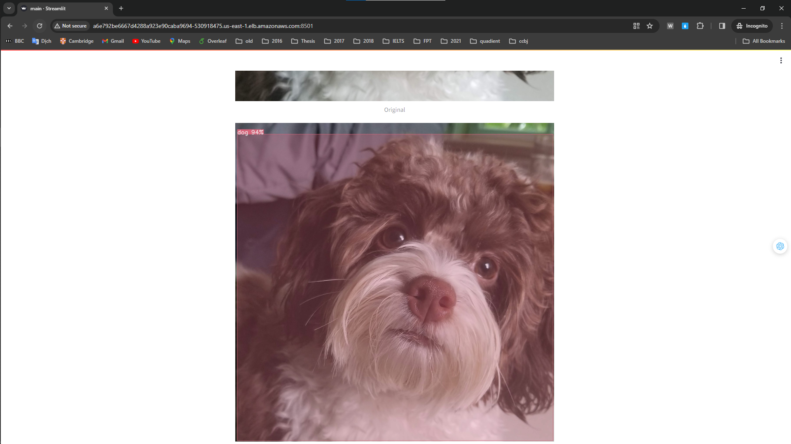
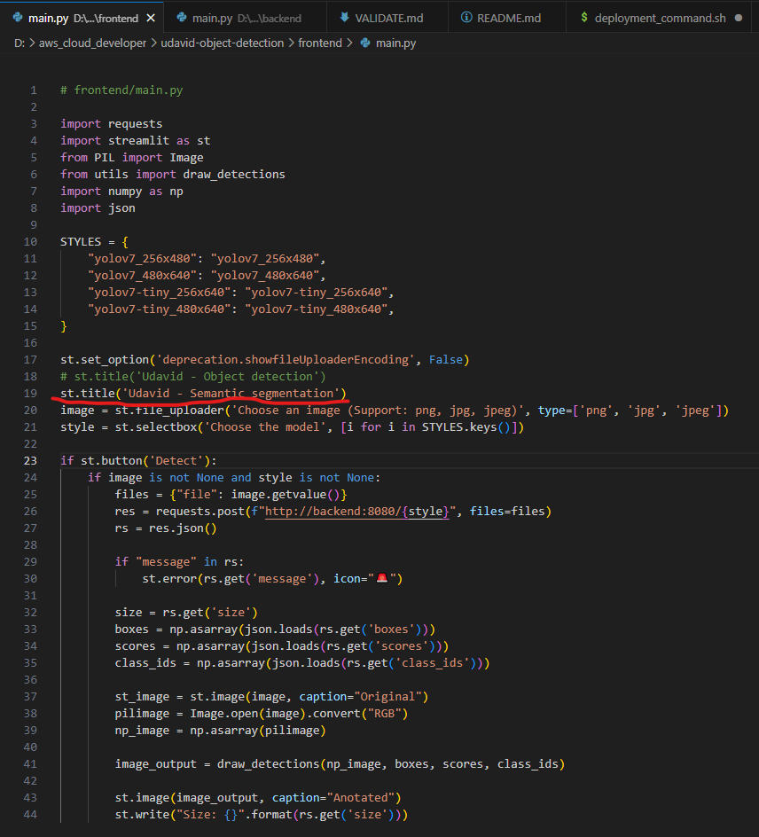
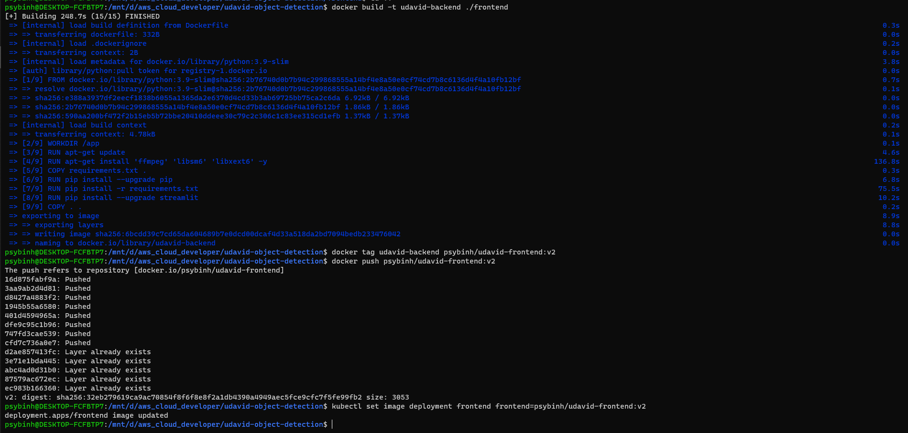
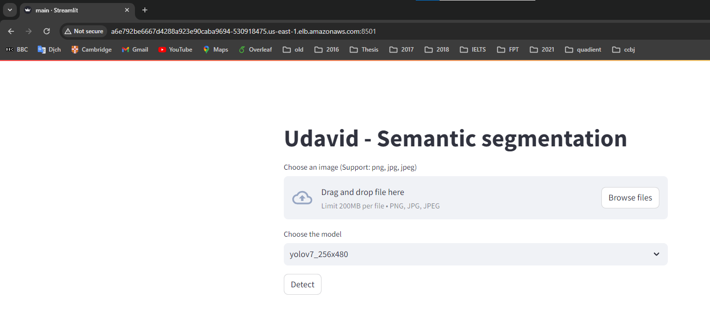

# CI/CD, Github & Code Quality

README: https://github.com/psybinh/udavid/blob/master/README.md

Circle CI screenshot: 

# Container

frontent Dockerfile: https://github.com/psybinh/udavid/blob/master/frontend/Dockerfile

backend Dockerfile: https://github.com/psybinh/udavid/blob/master/backend/Dockerfile

Docker hub screenshot:

`docker-compose.yml` file: https://github.com/psybinh/udavid/blob/master/docker-compose.yml

`docker-compose up` screenshot on the local:

Website screenshots:

# Deployment

`kubectl get deployments` screenshot:

`kubectl get pods` screenshot:

`kubectl get services` screenshot:

Website URL: http://a6e792be6667d4288a923e90caba9694-530918475.us-east-1.elb.amazonaws.com:8501

Website screenshots:

Edit title of the website

Re-deploy:

Result after deploy:

