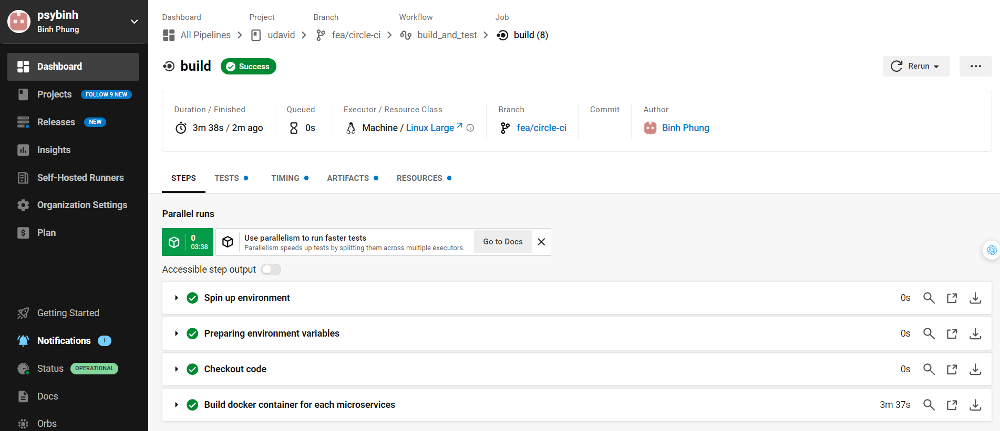
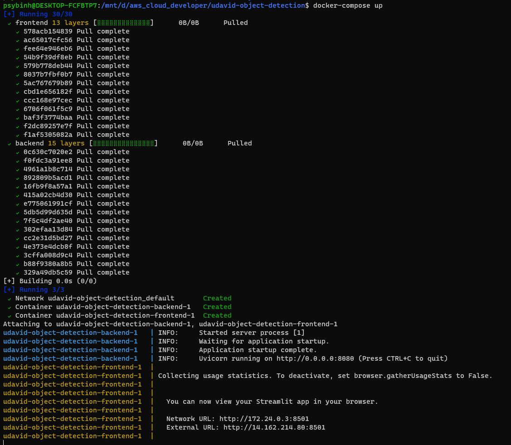

# CI/CD, Github & Code Quality

README: https://github.com/psybinh/udavid/blob/master/README.md

Circle CI screenshot: 

# Container

frontent Dockerfile: https://github.com/psybinh/udavid/blob/master/frontend/Dockerfile

backend Dockerfile: https://github.com/psybinh/udavid/blob/master/backend/Dockerfile

Docker hub screenshot:

`docker-compose.yml` file: https://github.com/psybinh/udavid/blob/master/docker-compose.yml

`docker-compose up` screenshot on the local:

Website screenshots:

# Deployment

<!-- `kubectl get deployments` screenshot: -->

<!-- `kubectl get pods` screenshot: -->

<!-- `kubectl get services` screenshot: -->

<!-- Website URL: -->

<!-- Website screenshots: -->

<!-- Add Yolo model `yolov7-tiny_736x1280.onnx` to S3 -->

<!-- Edit backend Dockerfile:  -->

<!-- Edit fronend code:  -->

<!-- Edit backend code: -->

<!-- Re-build fronend docker: -->

<!-- Re-build backend docker: -->

<!-- CloudWatch screenshot: -->
