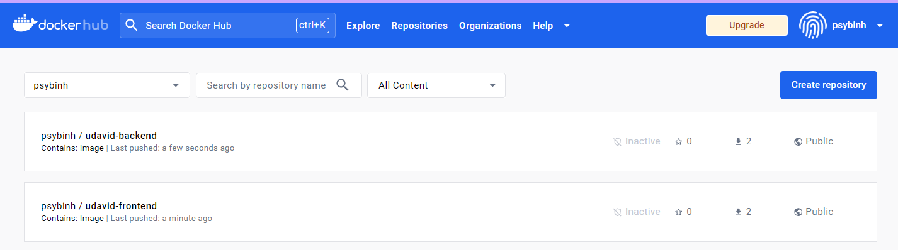
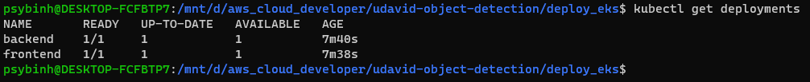
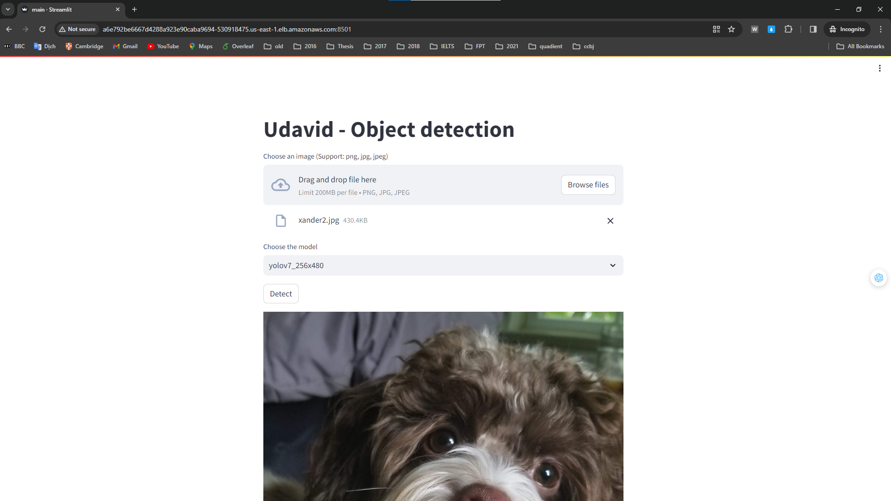
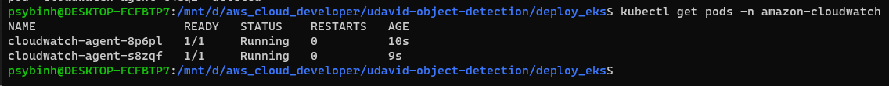

# CI/CD, Github & Code Quality

### The project demonstrates an understanding of CI and Github.

Circle CI configuration: 

Circle CI screenshot: 

### The project has a proper documentation.

README: https://github.com/psybinh/udavid/blob/master/README.md

### The project use continuous deployments (CD)

Deployment and service files are auto generated from docker-compose.yml using the tool `kompose`

Fontend deployment: https://github.com/psybinh/udavid/blob/master/deploy_eks/frontend-deployment.yaml

Backend deployment: https://github.com/psybinh/udavid/blob/master/deploy_eks/backend-deployment.yaml

Fontend service: https://github.com/psybinh/udavid/blob/master/deploy_eks/frontend-service.yaml

Backend service: https://github.com/psybinh/udavid/blob/master/deploy_eks/backend-service.yaml

# Container

### The app is containerized

frontent Dockerfile: https://github.com/psybinh/udavid/blob/master/frontend/Dockerfile

backend Dockerfile: https://github.com/psybinh/udavid/blob/master/backend/Dockerfile

### The project have public docker images

Docker hub screenshot:

### The applications runs in a container without errors

`docker-compose.yml` file: https://github.com/psybinh/udavid/blob/master/docker-compose.yml

`docker-compose up` screenshot on the local:

Website screenshots:

# Deployment

### The application runs on a cluster in the cloud

`kubectl get deployments` screenshot:

`kubectl get pods` screenshot:

`kubectl get services` screenshot:

Website URL: http://a6e792be6667d4288a923e90caba9694-530918475.us-east-1.elb.amazonaws.com:8501

Website screenshots:

### The app can be upgraded via rolling-update

Edit title of the website

rolling-update:

Result after deploy:

### A/B deployment of the application

not yet implemented

### Monitoring

Screenshot `kubectl get pods -n amazon-cloudwatch`:

Screenshot CloudWatch:

